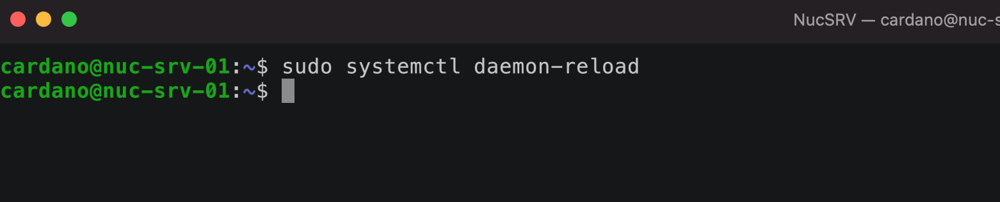

# Generating block producer keys

## 1) Generate node, VRF, and KES keys

```bash
04a_genNodeKeys.sh myPool cli
04b_genVRFKeys.sh myPool cli
04c_genKESKeys.sh myPool cli
04d_genNodeOpCert.sh myPool

ls -al myPool*
```

.png>)

## 2) Generate the pool certificate

Run the certificate generation script:

```bash
05a_genStakepoolCert.sh myPool
```

This creates a JSON template (`myPool.pool.json`). Edit it with your pool's details:

```bash
nano myPool.pool.json
```

.png>)

Example configuration for a single-owner pool:

| Parameter | Example value |
|-----------|--------------|
| Pledge | 1,000,000 ADA |
| Fixed fee | 340 ADA (current minimum) |
| Margin | 5% |
| Relays | IP-based: 89.191.111.111:3001, 89.191.111.112:3001 |
| Ticker | XPOOL |
| Metadata URL | https://yoursite.com/pool.metadata.json |
| Extended metadata URL | https://yoursite.com/pool.extended.json |

.png>)

After editing, re-run the certificate generation:

```bash
05a_genStakepoolCert.sh myPool
```

.png>)

The script creates an extended metadata template. Edit it:

```bash
nano myPool.additional-metadata.json
```

.png>)

Run the certificate generation one final time:

```bash
05a_genStakepoolCert.sh myPool
```



## 3) Upload metadata files

The script generates two metadata files that **must be uploaded to your web server** before proceeding:

| File | Upload to |
|------|-----------|
| `myPool.metadata.json` | Your metadata URL (defined in pool.json) |
| `myPool.extended-metadata.json` | Your extended metadata URL (defined in pool.json) |

Rename and upload them:

```bash
cp myPool.metadata.json pool.metadata.json
cp myPool.extended-metadata.json pool.extended.json
```

Upload via SCP, SFTP, or any method you prefer. Verify the URLs are accessible before continuing.

## 4) Create the delegation certificate

Delegate to your own pool:

```bash
05b_genDelegationCert.sh myPool poolOwner
```

## 5) Fund the pledge address

Send your pledged amount to the `poolOwner.payment` address:

```bash
cat poolOwner.payment.addr
```

.png>)

Send your pledge to this address and verify it has arrived:

```bash
01_queryAddress.sh poolOwner.payment
```

.png>)

## 6) Register the stake pool on-chain

Register the pool. `myWallet` pays the transaction fee and 500 ADA deposit:

```bash
05c_regStakepoolCert.sh myPool myWallet
```

.png>)

After registration propagates (minutes to hours), the pool will appear in wallets like Daedalus:

.png>)
