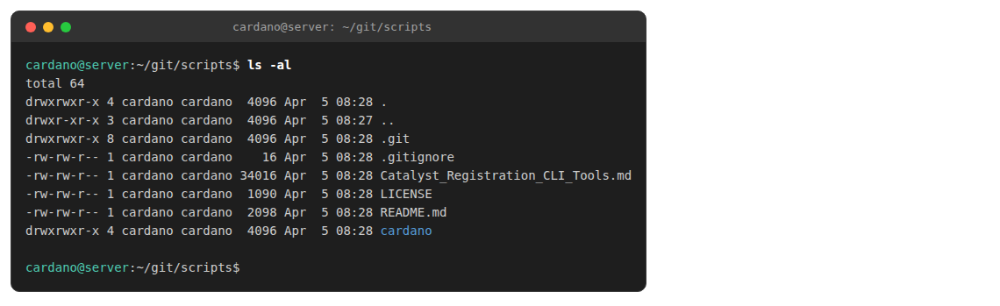
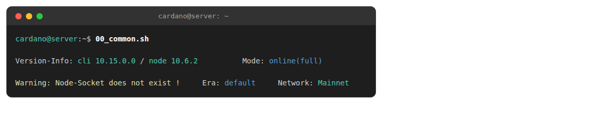

# Installing SPOS (StakePool Operator Scripts)


Install these scripts on a **secure, offline workstation** — not on your online relay or BP server. The keys generated here control your wallets and stake pool. Anyone with access to these keys has full control over your funds and pool.



SPOS supports air-gapped (offline) key generation and hardware wallets (Trezor/Ledger) for maximum security.


## 1) Install dependencies

```bash
sudo apt update -y
sudo apt install -y curl bc jq
```

## 2) Clone the SPOS repository

```bash
cd ~
mkdir -p git && cd git
rm -rf scripts
git clone https://github.com/gitmachtl/scripts
cd scripts
ls -al
```

<figure><figcaption></figcaption></figure>

## 3) Copy scripts to your PATH



```bash
cp cardano/mainnet/* ~/.local/bin/
```



```bash
cp cardano/testnet/* ~/.local/bin/
```



## 4) Create the SPOS configuration file

This tells the scripts where to find the node socket and genesis files. Placing it in your home directory means you do not need to reconfigure when upgrading scripts.



```bash
cat <<EOF > ~/.common.inc
socket="/home/cardano/cnode/sockets/node.socket"

genesisfile="/home/cardano/cnode/config/shelley-genesis.json"
genesisfile_byron="/home/cardano/cnode/config/byron-genesis.json"

cardanocli="cardano-cli"
cardanonode="cardano-node"

magicparam="--mainnet"
addrformat="--mainnet"

byronToShelleyEpochs=208
EOF
```



```bash
cat <<EOF > ~/.common.inc
socket="/home/cardano/cnode/sockets/node.socket"

genesisfile="/home/cardano/cnode/config/shelley-genesis.json"
genesisfile_byron="/home/cardano/cnode/config/byron-genesis.json"

cardanocli="cardano-cli"
cardanonode="cardano-node"

magicparam="--testnet-magic 1"
addrformat="--testnet-magic 1"

byronToShelleyEpochs=4
EOF
```



## 5) Verify installation

```bash
00_common.sh
```

<figure><figcaption></figcaption></figure>

The output shows the detected `cardano-cli` and `cardano-node` versions, the operating mode, and the configured network.


The "Warning: Node-Socket does not exist" message is expected if the node is not running on this machine (e.g., on an offline workstation).

