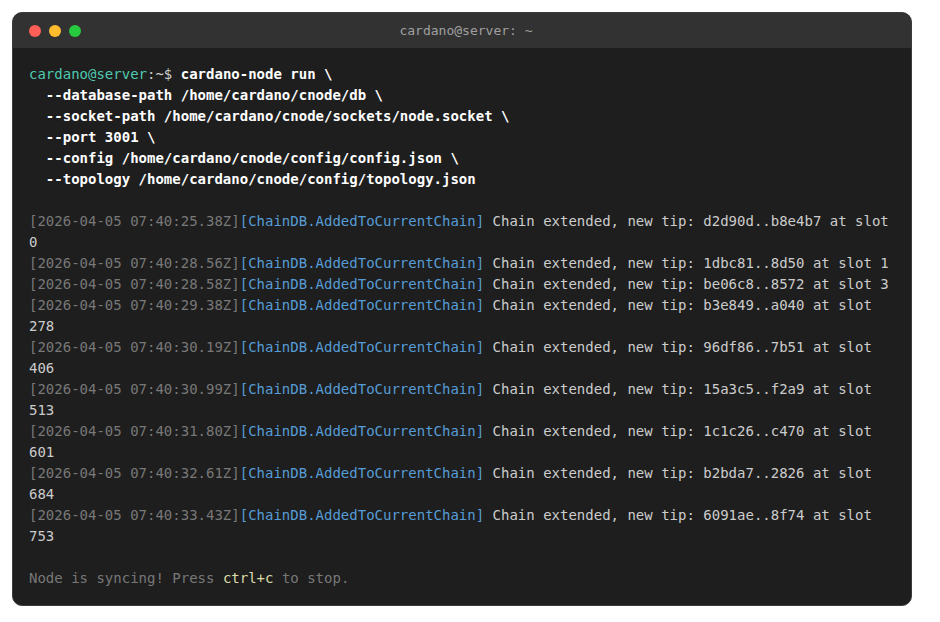

# Cardano Relay Configuration


If you followed the installation guide, your config files are already in `~/cnode/config/`. This section covers relay-specific adjustments. If you need to re-download configs, see the tabs below.


### Understanding relay vs block producer

Your **relay nodes** are publicly reachable and connect to the wider Cardano network. They shield your **block producer** (BP) from direct internet exposure. A typical setup is 1 BP + 2 relays.

The default `topology.json` from the release uses **P2P (peer-to-peer)** networking, which automatically discovers and connects to peers. After you set up your BP, you should add it as a local root peer in your relay's `topology.json` so they stay connected. This is covered in the BP section.

### Updating configuration files (optional)

If you need to fetch the latest configs manually (e.g. after a new node release):



```bash
cd ~/cnode/config

curl -o config.json https://book.play.dev.cardano.org/environments/mainnet/config.json
curl -o topology.json https://book.play.dev.cardano.org/environments/mainnet/topology.json
curl -o byron-genesis.json https://book.play.dev.cardano.org/environments/mainnet/byron-genesis.json
curl -o shelley-genesis.json https://book.play.dev.cardano.org/environments/mainnet/shelley-genesis.json
curl -o alonzo-genesis.json https://book.play.dev.cardano.org/environments/mainnet/alonzo-genesis.json
curl -o conway-genesis.json https://book.play.dev.cardano.org/environments/mainnet/conway-genesis.json

ls -al
```



```bash
cd ~/cnode/config

curl -o config.json https://book.play.dev.cardano.org/environments/preprod/config.json
curl -o topology.json https://book.play.dev.cardano.org/environments/preprod/topology.json
curl -o byron-genesis.json https://book.play.dev.cardano.org/environments/preprod/byron-genesis.json
curl -o shelley-genesis.json https://book.play.dev.cardano.org/environments/preprod/shelley-genesis.json
curl -o alonzo-genesis.json https://book.play.dev.cardano.org/environments/preprod/alonzo-genesis.json
curl -o conway-genesis.json https://book.play.dev.cardano.org/environments/preprod/conway-genesis.json

ls -al
```



You should have 6 files in the config folder: `config.json`, `topology.json`, `byron-genesis.json`, `shelley-genesis.json`, `alonzo-genesis.json`, `conway-genesis.json`.

### Quick test run

Let's verify the node starts correctly before setting up the systemd service:

```bash
cardano-node run \
  --database-path /home/cardano/cnode/db \
  --socket-path /home/cardano/cnode/sockets/node.socket \
  --port 3001 \
  --config /home/cardano/cnode/config/config.json \
  --topology /home/cardano/cnode/config/topology.json
```

If you followed the guide, you should see the node start syncing:

<figure><figcaption></figcaption></figure>

Press <mark style="color:blue;">ctrl+c</mark> to stop and continue to the next chapter.

