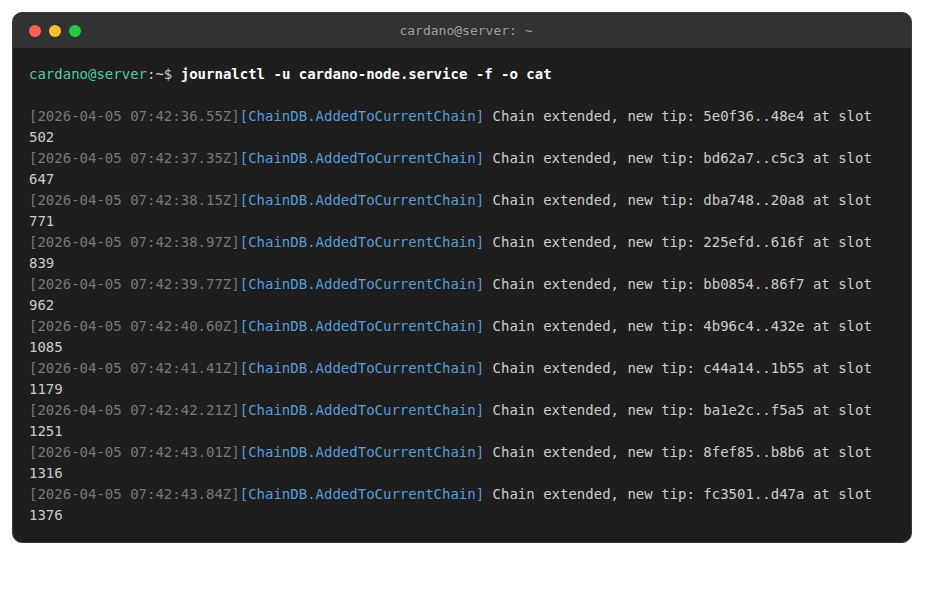

# Launching the relay node

Running cardano-node as a **systemd service** is the recommended approach for production servers. The node starts automatically on boot and restarts on failure.

## Create the systemd service

```bash
cat <<EOF | sudo tee /etc/systemd/system/cardano-node.service
[Unit]
Description=Cardano Relay Node
After=network-online.target
Wants=network-online.target

[Service]
Type=simple
User=cardano
Group=cardano
WorkingDirectory=/home/cardano/cnode
ExecStart=/home/cardano/.local/bin/cardano-node run \\
    --config /home/cardano/cnode/config/config.json \\
    --topology /home/cardano/cnode/config/topology.json \\
    --database-path /home/cardano/cnode/db \\
    --socket-path /home/cardano/cnode/sockets/node.socket \\
    --host-addr 0.0.0.0 \\
    --port 3001
KillSignal=SIGINT
RestartKillSignal=SIGINT
StandardOutput=journal
StandardError=journal
SyslogIdentifier=cardano-relay
LimitNOFILE=1048576
Restart=on-failure
RestartSec=5

[Install]
WantedBy=multi-user.target
EOF
```

## Enable and start

```bash
sudo systemctl daemon-reload
sudo systemctl enable cardano-node.service
sudo systemctl start cardano-node.service
```


## Verify the node is running

```bash
journalctl -u cardano-node.service -f -o cat
```

<figure><figcaption></figcaption></figure>

Your first relay is running. Repeat this process on your second relay server.

---

## Architecture overview

A stake pool requires a minimum of 2 servers:

| Role | Purpose |
|------|---------|
| **Relay nodes** (1-2) | Publicly reachable, connect to the Cardano network, shield the BP from direct exposure |
| **Block producer** (1) | Mints blocks, connected only to your relays |
| **Offline machine** | Air-gapped computer for generating and storing cold keys and signing transactions |

Recommended: 2 relay nodes per block producer.


---

## Topology: connecting relays to your BP

After you set up your block producer, edit `topology.json` on **each** server so they know about each other.

### On each relay — add your BP as a local root peer

Edit `~/cnode/config/topology.json` and add your BP's **private IP** in the `localRoots` section:

```json
{
  "bootstrapPeers": [
    { "address": "backbone.cardano.iog.io", "port": 3001 },
    { "address": "backbone.mainnet.emurgornd.com", "port": 3001 },
    { "address": "backbone.mainnet.cardanofoundation.org", "port": 3001 }
  ],
  "localRoots": [
    {
      "accessPoints": [
        { "address": "YOUR_BP_PRIVATE_IP", "port": 3001, "description": "my BP" },
        { "address": "YOUR_OTHER_RELAY_IP", "port": 3001, "description": "my relay 2" }
      ],
      "advertise": false,
      "trustable": true,
      "hotValency": 2
    }
  ],
  "publicRoots": [
    { "accessPoints": [], "advertise": false }
  ],
  "useLedgerAfterSlot": 128908821
}
```

### On the BP — add your relays only

Set `useLedgerAfterSlot` to `-1` so the BP only connects to your relays and never discovers random peers. Remove `bootstrapPeers` entries:

```json
{
  "bootstrapPeers": [],
  "localRoots": [
    {
      "accessPoints": [
        { "address": "YOUR_RELAY1_IP", "port": 3001, "description": "relay 1" },
        { "address": "YOUR_RELAY2_IP", "port": 3001, "description": "relay 2" }
      ],
      "advertise": false,
      "trustable": true,
      "hotValency": 2
    }
  ],
  "publicRoots": [
    { "accessPoints": [], "advertise": false }
  ],
  "useLedgerAfterSlot": -1
}
```


**`hotValency`** — number of peers the node actively maintains connections to. Set it to the number of nodes in the group.

**`trustable: true`** — use for your own infrastructure (BP and relays). For external pool peers, use `false`.

**`useLedgerAfterSlot: -1`** on the BP prevents it from connecting to random peers.


After editing topology, restart the node:

```bash
sudo systemctl restart cardano-node
```


**Never generate wallet or stake pool keys on your online servers.** Use an offline (air-gapped) machine or a hardware wallet (Trezor/Ledger). Anyone with access to your keys has full control over your pool and funds.

